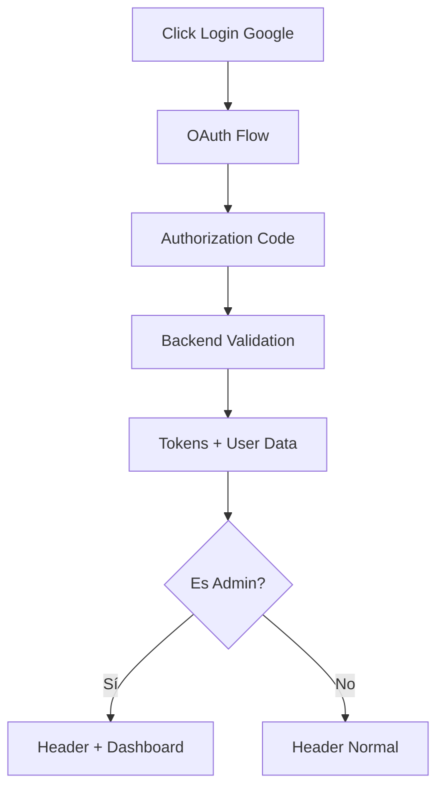

# 🔐 Módulo de Login y Autenticación

[⬅ Regresar al índice](../modules.md)

Este módulo gestiona la autenticación de usuarios en la aplicación Real Estate App, incluyendo el sistema de roles y la navegación basada en permisos.

## 🔍 Resumen del Módulo

El módulo de login maneja:

- **Autenticación con Google OAuth 2.0**
- **Login con email y contraseña**
- **Sistema de roles (OWNER/ADMIN)**
- **Protección de rutas basada en roles**
- **Navegación condicional según permisos**

## 👥 Sistema de Roles

### **OWNER (Usuario Regular)**

- **Valor**: `0`
- **Permisos**: Ver propiedades, gestionar sus propias propiedades, favoritos
- **Navegación**: Header normal, sin acceso al panel de administración

### **ADMIN (Administrador)**

- **Valor**: `1`
- **Permisos**: Todos los permisos de OWNER + panel de administración
- **Navegación**: Header con botón "Dashboard", acceso completo al admin panel

## 🧭 Navegación Basada en Roles

### Rutas por Tipo de Usuario

**Rutas Públicas** (sin autenticación):

- Home, Properties, Agents, Services, Blog, Contact

**Rutas de Usuario** (requiere login):

- Favorites, My Properties, Profile Settings

**Rutas de Admin** (requiere rol ADMIN):

- `/admin` - Dashboard principal
- `/admin/users` - Gestión de usuarios
- `/admin/properties` - Gestión de propiedades
- `/admin/analytics` - Análisis y reportes

### Guards de Protección

**BlockedAuthContainer**: Redirige usuarios autenticados fuera de páginas de login

**BlockedUnAuthorizedContainer**: Requiere autenticación

**BlockedUnAuthorizedAdminContainer**: Requiere rol de administrador

## 🔄 Flujo de Autenticación

### 1. Login con Google OAuth



### 2. Navegación Condicional

**En el Header:**

```typescript
{user.isAdmin && (
  <Link to="/admin">
    <Button>DASHBOARD</Button>
  </Link>
)}
```

**En el UserProfileMenu:**

```typescript
{user.isAdmin && (
  <DropdownMenuItem>
    <Link to="/admin">Admin Panel</Link>
  </DropdownMenuItem>
)}
```

## 🛡️ Cómo Funciona la Navegación

### Para Usuario Regular (OWNER)

1. **Login** → Redirige a Home
2. **Header** → Muestra navegación normal (Properties, Agents, etc.)
3. **Profile Menu** → Opciones: Edit Profile, My Favorites, My Properties, Sign Out
4. **Rutas disponibles** → Todas las públicas + sus propiedades y favoritos

### Para Administrador (ADMIN)

1. **Login** → Redirige a Home
2. **Header** → Navegación normal + **botón "DASHBOARD"**
3. **Profile Menu** → Opciones normales + **"Admin Panel"**
4. **Rutas disponibles** → Todas las anteriores + rutas administrativas
5. **Admin Panel** → Sidebar con: Dashboard, Users, Owners, Properties, Analytics, Logs

### Seguridad

- **Frontend Guards** validan tokens y roles antes de mostrar componentes
- **Backend** siempre valida permisos en cada request
- **Redirección automática** si no tiene permisos para una ruta
- **UI condicional** muestra/oculta elementos según el rol del usuario

## 🔧 Variables de Entorno

```bash
VITE_GOOGLE_CLIENT_ID=your_google_client_id
VITE_API_BASE_URL=your_api_base_url
```

---

[⬅ Regresar al índice](../modules.md)
