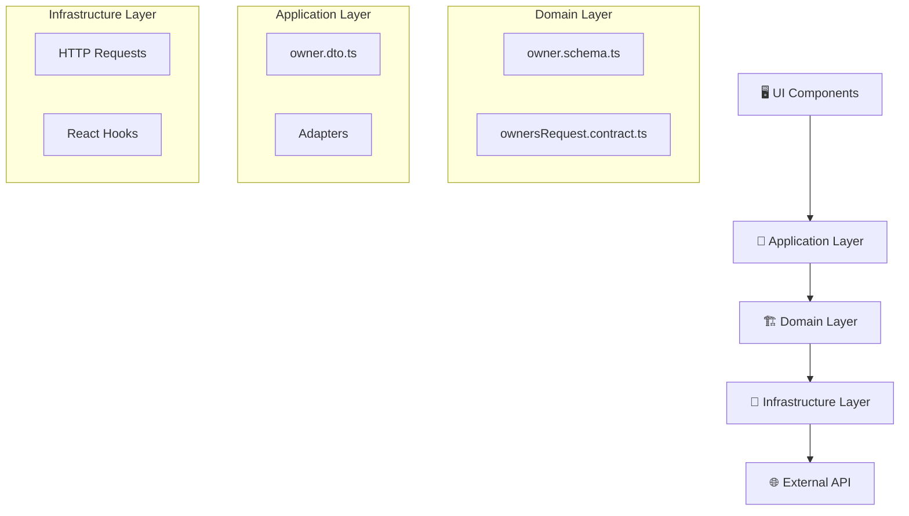

# 👥 Módulo de Propietarios

[⬅ Regresar al índice](../modules.md)

## 📊 Descripción General

El **Módulo de Propietarios (Owners)** es el componente encargado de la gestión integral de los propietarios de inmuebles en la plataforma. Este módulo permite el CRUD completo de propietarios, vinculación con propiedades, gestión de datos personales y seguimiento de métricas de propiedades por propietario.

### 🎯 Objetivos del Módulo

- **Gestión de Propietarios**: CRUD completo (Create, Read, Update, Delete)
- **Vinculación con Propiedades**: Conexión directa entre propietarios y sus inmuebles
- **Datos Personales**: Manejo de información de contacto y personal
- **Métricas y Estadísticas**: Conteo de propiedades por propietario
- **Búsqueda y Filtrado**: Sistema de búsqueda avanzada por nombre, email y teléfono

---

## 🏗️ Arquitectura del Módulo

### 📁 Estructura de Directorios

```
src/app/modules/
├── admin//presentation/react/
│   ├── containers/ownersManagement/
│   │   └── ownersManagement.container.tsx
│   ├── layouts/ownersManagement/
│   │   └── ownersManagement.layout.tsx
│   └── components/ownerManagementDialog/
│       └── ownerManagementDialog.tsx
└── shared/
    ├── domain/
    │   ├── schemas/owner.schema.ts
    │   └── contracts/ownersRequest.contract.ts
    ├── application/
    │   ├── dtos/owner.dto.ts
    │   └── adapters/
    │       ├── owner/owner.adapter.ts
    │       └── ownerDto/ownerDto.adapter.ts
    └── infrastructure/
        ├── requests/ (7 archivos de requests)
        └── ui/react/hooks/ (7 hooks personalizados)
```

### 🔄 Flujo de Datos (Hexagonal Architecture)



---

## 📋 Modelo de Datos

### 🏷️ Owner Schema

```typescript
export const ownerSchema = z.object({
  id: objectIdSchema,                    // MongoDB ObjectId (24 caracteres hex)
  userId: objectIdSchema.optional(),     // Relación con User (opcional)
  name: z.string().min(1).max(100),      // Nombre completo (1-100 caracteres)
  address: z.string().max(200).optional(), // Dirección (máximo 200 caracteres)
  phone: z.string().regex(/^\+?[1-9]\d{1,14}$/).optional(), // Teléfono internacional
  email: z.email().min(5).max(100).optional(), // Email válido (5-100 caracteres)
  photoUrl: z.string().optional(),       // URL de foto de perfil
  birthday: z.string().optional(),       // Fecha de nacimiento (ISO string)
  createdAt: z.iso.datetime().optional() // Fecha de creación
});

export type Owner = z.infer<typeof ownerSchema>;
export type CreateOwner = z.infer<typeof ownerSchema.omit<{ id: true }>>;
```

### 📤 Owner DTO (Data Transfer Object)

```typescript
export interface OwnerDto {
  idOwner: string;    // ID del propietario (mapping: id)
  userId?: string;    // ID del usuario vinculado
  name: string;       // Nombre completo
  address?: string;   // Dirección
  phone?: string;     // Teléfono
  email?: string;     // Email
  photo?: string;     // URL de foto (mapping: photoUrl)
  birthday?: string;  // Fecha de nacimiento
  createdAt?: string; // Fecha de creación
}
```

---

## 🔧 Funcionalidades Principales

### 1. 📝 **Gestión CRUD de Propietarios**

#### ✅ Crear Propietario
- **Endpoint**: `POST /owners`
- **Campos requeridos**: `name`, `email`, `phone`, `address`
- **Campos opcionales**: `birthday`, `photoUrl`
- **Validación**: Schema validation con Zod
- **Hook**: `useCreateOwnerRequest`

#### 📖 Listar Propietarios
- **Endpoint**: `GET /owners`
- **Respuesta**: Array de propietarios
- **Hook**: `useGetOwnersRequest`
- **Características**:
  - Carga automática al montar componente
  - Manejo de estados loading/error
  - Cache automático con TanStack Query

#### 🔍 Obtener Propietario por ID
- **Endpoint**: `GET /owners/:id`
- **Hook**: `useGetOwnerByIdRequest`
- **Uso**: Detalles específicos de un propietario

#### 🔄 Actualizar Propietario
- **Endpoint**: `PUT /owners/:id`
- **Hook**: `useUpdateOwnerRequest`
- **Funcionalidad**: Edición completa de datos

#### 🗑️ Eliminar Propietario
- **Endpoint**: `DELETE /owners/:id`
- **Hook**: `useDeleteOwnerRequest`
- **Confirmación**: Dialog de confirmación antes de eliminar

### 2. 🔗 **Vinculación con Usuarios y Propiedades**

#### 👤 Obtener Propietario por User ID
- **Endpoint**: `GET /owners/user/:userId`
- **Hook**: `useGetOwnerByUserIdRequest`
- **Propósito**: Conectar usuarios del sistema con propietarios

#### 🏠 Contar Propiedades por Propietario
- **Endpoint**: `GET /owners/:ownerId/properties-count`
- **Hook**: `useGetPropertiesCountByOwnerIdRequest`
- **Retorna**: Número total de propiedades del propietario
- **Uso**: Dashboard y métricas

### 3. 🔍 **Sistema de Búsqueda y Filtrado**

```typescript
const filteredOwners = owners.filter(owner =>
  owner.name.toLowerCase().includes(searchTerm.toLowerCase()) ||
  (owner.email && owner.email.toLowerCase().includes(searchTerm.toLowerCase())) ||
  (owner.phone && owner.phone.includes(searchTerm))
);
```

**Campos de búsqueda**:
- ✅ Nombre completo
- ✅ Email
- ✅ Teléfono

---

## 🖥️ Componentes de UI

### 1. 📊 **OwnersManagementLayout**

**Características principales**:
- **Dashboard de métricas**: Total de propietarios, propiedades, promedios
- **Tabla de propietarios**: Lista completa con paginación
- **Barra de búsqueda**: Filtrado en tiempo real
- **Acciones por fila**: Editar y eliminar

**Métricas mostradas**:
```typescript
// Métricas del Dashboard
const metrics = {
  totalOwners: owners.length,
  totalProperties: "Calculating...", // Pendiente de implementación
  averagePerOwner: "Calculating..."   // Pendiente de implementación
};
```

### 2. 📝 **OwnerManagementDialog**

**Funcionalidades**:
- **Modo Crear**: Formulario vacío para nuevo propietario
- **Modo Editar**: Formulario precargado con datos existentes
- **Validación en tiempo real**: TypeScript + Zod validation
- **Estados de carga**: Loading states durante operaciones
- **Manejo de errores**: Display de errores de API

**Campos del formulario**:
```typescript
interface FormFields {
  name: string;        // Nombre completo (requerido)
  email: string;       // Email (requerido)
  address: string;     // Dirección (requerido)
  phone: string;       // Teléfono (requerido)
  birthday: string;    // Fecha de nacimiento (opcional)
}
```

### 3. 📋 **Tabla de Propietarios**

**Columnas mostradas**:
- **Nombre**: Nombre completo del propietario
- **Contacto**: Email y teléfono con iconos
- **Dirección**: Dirección completa o "N/A"
- **Fecha de Nacimiento**: Formato localizado o "N/A"
- **Propiedades**: Conteo de propiedades (actualmente "Calculating...")
- **Fecha de Registro**: Fecha de creación formateada
- **Acciones**: Botones de editar y eliminar

---

## 🎣 Hooks Personalizados

### 1. **useCreateOwnerRequest**
```typescript
const { onCreateOwner, isPending, error, data } = useCreateOwnerRequest({
  onSuccess: () => console.log('Owner created successfully')
});
```

### 2. **useGetOwnersRequest**
```typescript
const { onGetOwners, isPending, error, data: owners } = useGetOwnersRequest();
```

### 3. **useUpdateOwnerRequest**
```typescript
const { onUpdateOwner, isPending, error } = useUpdateOwnerRequest({
  onSuccess: () => onGetOwners()
});
```

### 4. **useDeleteOwnerRequest**
```typescript
const { onDeleteOwner, isPending, error } = useDeleteOwnerRequest({
  onSuccess: () => onGetOwners()
});
```

### 5. **useGetOwnerByIdRequest**
```typescript
const { isPending, error, data: owner } = useGetOwnerByIdRequest(ownerId);
```

### 6. **useGetOwnerByUserIdRequest**
```typescript
const { isPending, error, data: owners } = useGetOwnerByUserIdRequest(userId);
```

### 7. **useGetPropertiesCountByOwnerIdRequest**
```typescript
const { isPending, error, data: count } = useGetPropertiesCountByOwnerIdRequest(ownerId);
```

---

## 🔄 Adapters y Transformaciones

### 📤 Owner Adapter (Domain → DTO)
```typescript
export const ownerAdapter = (owner: Owner): OwnerDto => ({
  idOwner: owner.id,
  userId: owner.userId,
  name: owner.name,
  address: owner.address,
  phone: owner.phone,
  email: owner.email,
  photo: owner.photoUrl,    // Transformación: photoUrl → photo
  birthday: owner.birthday,
  createdAt: owner.createdAt,
});
```

### 📥 Owner DTO Adapter (DTO → Domain)
```typescript
export const ownerDtoAdapter = (ownerDTO: OwnerDto): Owner => ({
  id: ownerDTO.idOwner,     // Transformación: idOwner → id
  userId: ownerDTO.userId,
  name: ownerDTO.name,
  address: ownerDTO.address,
  phone: ownerDTO.phone,
  email: ownerDTO.email,
  photoUrl: ownerDTO.photo, // Transformación: photo → photoUrl
  birthday: ownerDTO.birthday,
  createdAt: ownerDTO.createdAt,
});
```

---

## 🌐 Endpoints API

| Método | Endpoint | Descripción | Hook |
|--------|----------|-------------|------|
| `POST` | `/owners` | Crear propietario | `useCreateOwnerRequest` |
| `GET` | `/owners` | Listar propietarios | `useGetOwnersRequest` |
| `GET` | `/owners/:id` | Obtener por ID | `useGetOwnerByIdRequest` |
| `GET` | `/owners/user/:userId` | Obtener por User ID | `useGetOwnerByUserIdRequest` |
| `GET` | `/owners/:ownerId/properties-count` | Contar propiedades | `useGetPropertiesCountByOwnerIdRequest` |
| `PUT` | `/owners/:id` | Actualizar propietario | `useUpdateOwnerRequest` |
| `DELETE` | `/owners/:id` | Eliminar propietario | `useDeleteOwnerRequest` |

---

## 🚦 Estados y Validaciones

### ✅ Validaciones de Campos

```typescript
const COMMONS_VALIDATIONS = {
  NAME: { min: 1, max: 100 },              // Nombre: 1-100 caracteres
  EMAIL: { min: 5, max: 100 },             // Email: 5-100 caracteres
  ADDRESS: { min: 5, max: 200 },           // Dirección: 5-200 caracteres
  PHONE: { pattern: /^\+?[1-9]\d{1,14}$/ }, // Teléfono: formato internacional
} as const;
```

### 🔄 Estados de Carga

```typescript
interface LoadingStates {
  isPendingOwners: boolean;    // Cargando lista de propietarios
  isPendingDelete: boolean;    // Eliminando propietario
  isPendingCreate: boolean;    // Creando propietario
  isPendingUpdate: boolean;    // Actualizando propietario
}
```

### ⚠️ Manejo de Errores

```typescript
// Error handling en componentes
if (error) {
  return <div className="text-destructive">Error loading owners: {error.message}</div>;
}

// Toast notifications para operaciones
toast.error('Create owner failed. Please try again.', {
  duration: Infinity,
});
```

---

## 🔗 Relaciones con Otros Módulos

### 🏠 **Módulo de Properties**
- **Vinculación**: Cada propiedad tiene un `ownerId`
- **Display**: En Properties se muestra `ownerName`
- **Conteo**: Endpoint para contar propiedades por propietario

### 👤 **Sistema de Usuarios**
- **Conexión**: `userId` opcional en Owner schema
- **Propósito**: Vincular propietarios con usuarios del sistema
- **Endpoint**: `GET /owners/user/:userId`

### 🔐 **Control de Acceso**
- **Rol requerido**: `ADMIN` para gestión de propietarios
- **Ubicación**: Dentro del panel de administración
- **Ruta**: `/admin/owners`

---

## 📈 Métricas y Analíticas

### 📊 Dashboard Metrics (Implementadas)
- ✅ **Total Owners**: `owners.length`
- ✅ **Búsqueda en tiempo real**: Filtrado por nombre, email, teléfono

### 📊 Métricas Pendientes
- 🔄 **Total Properties**: Suma de propiedades de todos los propietarios
- 🔄 **Average per Owner**: Promedio de propiedades por propietario
- 🔄 **Propiedades por Owner**: Display individual en tabla

---

## 🛠️ Stack Tecnológico

### 🎨 **Frontend**
- **React 19**: UI framework
- **TypeScript**: Type safety
- **TanStack Query**: State management y caching
- **TanStack Router**: Routing
- **Tailwind CSS**: Styling
- **Shadcn/ui**: Component library
- **Lucide React**: Icons

### 🔧 **Validación y Tipos**
- **Zod**: Schema validation
- **TypeScript**: Type definitions
- **Adapters**: Domain/DTO transformations

### 🌐 **HTTP Client**
- **Ky**: HTTP requests
- **Error handling**: Automatic error management
- **Type safety**: Full TypeScript integration

---

## 🎯 Casos de Uso Principales

### 1. **Admin crea nuevo propietario**
```typescript
// 1. Admin abre dialog de creación
setIsDialogOpen(true);

// 2. Completa formulario y envía
const newOwner = { name, email, phone, address, birthday };
onCreateOwner(newOwner);

// 3. Success: Dialog se cierra y lista se actualiza
onSuccess: () => {
  onResetForm();
  onGetOwners();
}
```

### 2. **Admin busca propietario específico**
```typescript
// 1. Admin escribe en barra de búsqueda
setSearchTerm("john@email.com");

// 2. Lista se filtra automáticamente
const filteredOwners = owners.filter(/* filtros por nombre, email, teléfono */);

// 3. Resultados se muestran en tiempo real
```

### 3. **Admin edita información de propietario**
```typescript
// 1. Admin hace clic en botón editar
handleEdit(owner);

// 2. Dialog se abre con datos precargados
setEditingOwner(owner);
setIsDialogOpen(true);

// 3. Modifica datos y guarda
onUpdateOwner({ ...editingOwner, ...formData });
```

### 4. **Sistema cuenta propiedades por propietario**
```typescript
// Hook para obtener conteo
const { data: count } = useGetPropertiesCountByOwnerIdRequest(owner.id);

// Display en UI
<span>Propiedades: {count || 0}</span>
```

---

## 🚀 Mejoras Futuras

### 📋 **Funcionalidades Pendientes**
- [ ] **Implementar conteo real de propiedades** en dashboard
- [ ] **Upload de fotos de perfil** para propietarios  
- [ ] **Filtros avanzados** (fecha de registro, rango de propiedades)
- [ ] **Exportación de datos** (CSV, Excel)
- [ ] **Historial de cambios** (audit trail)

### 🎨 **Mejoras de UI/UX**
- [ ] **Paginación** para listas grandes
- [ ] **Ordenamiento de columnas** en tabla
- [ ] **Vista de detalles** expandida por propietario
- [ ] **Bulk operations** (eliminar múltiples)

### 🔧 **Optimizaciones Técnicas**
- [ ] **Implementar caching** más granular
- [ ] **Lazy loading** de componentes
- [ ] **Optimistic updates** en mutaciones
- [ ] **Virtual scrolling** para performance

---

## 🧪 Testing

### 🧪 **Test Coverage**
- ✅ **Mocks disponibles**: `OWNER_MOCK`, `OWNER_DTO_MOCK`
- 🔄 **Unit tests**: Pendientes para hooks y componentes
- 🔄 **Integration tests**: Pendientes para flujos completos
- 🔄 **E2E tests**: Pendientes para casos de uso

### 📝 **Test Data**
```typescript
// Mock data para testing
export const OWNER_MOCK: Owner = {
  id: '68cc5fc3f1022f7ba8797ad3',
  userId: '68cc5fc3f1022f7ba8797ad4',
  name: 'Owner Name',
  address: 'owner address',
  phone: '123-456-7890',
  email: 'owner@email.com',
  photoUrl: 'https://example.com/photo.jpg',
  birthday: '2025-09-18T19:38:42.296Z',
  createdAt: '2024-01-01T00:00:00.000Z',
};
```

---

[⬅ Regresar al índice](../modules.md)
