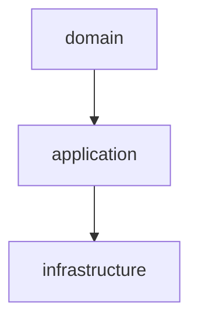
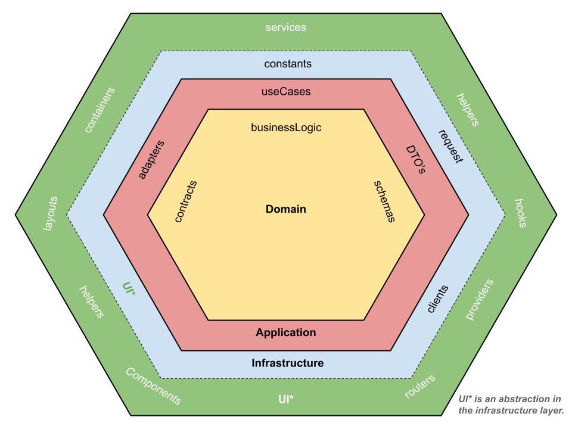

# 🧱 Hexagonal Frontend Architecture

[⬅ Regresar al índice](../real-estate-app.md)

Este proyecto sigue una **arquitectura hexagonal adaptada al frontend**, organizada en capas concéntricas que promueven una alta cohesión interna y bajo acoplamiento entre capas. Su objetivo es mantener una estructura escalable, testeable y fácilmente entendible por todo el equipo.

## 🗭 Capas y Responsabilidades

### 1. `infrastructure/` (Capa más externa)

Contiene toda la implementación técnica que interactúa con agentes externos o el entorno del navegador, incluyendo la interfaz de usuario.

- **Propósito:** Resolver cómo se hacen las cosas, no qué se hace. Incluye la UI y las integraciones externas.
- **Subcarpetas comunes:**

  - `UI/`: Interfaz de usuario del framework (React, Angular, Vue, etc.)
    - `components/`: Componentes visuales reutilizables.
    - `layouts/`: Estructuras de diseño.
    - `containers/`: Componentes que conectan lógica con UI.
  - `constants/`: Constantes globales del sistema.
  - `helpers/`: Utilidades técnicas reutilizables.
  - `requests/`: Llamadas HTTP centralizadas.
  - `clients/`: Configuraciones de instancias como Axios, TanStack Query, etc.

✅ Puede importar de: `application/`, `domain/`
🚫 **No puede ser importada** por `application/`, `domain/`.

---

### 2. `application/`

Contiene la lógica de orquestación de acciones y los elementos de integración entre capas.

- **Propósito:** Coordinar el comportamiento del sistema mediante casos de uso y manejar la transformación de datos.
- **Subcarpetas comunes:**

  - `useCases/`: Casos de uso (acciones del negocio como "crear usuario", "listar productos").
  - `adapters/`: Adaptadores para integrar con APIs o transformar datos entre capas.
  - `dtos/`: Objetos de transferencia de datos (Data Transfer Objects).

✅ Puede importar de: `domain/`
🚫 **No puede ser importada** por `domain`

---

### 4. `domain/` (Capa más interna)

Define las reglas de negocio puras. No depende de ningún framework, librería o implementación.

- **Propósito:** Modelar y definir reglas de negocio.
- **Subcarpetas comunes:**

  - `schemas/`: Validaciones y modelos (Zod, Yup, etc.).
  - `businessLogic/`: Lógica pura de negocio (funciones, clases, etc.).
  - `contracts/`: Interfaces, tipos o contratos de comunicación.

🚫 **No puede importar** de ninguna otra capa,
✅ **Puede se importada** por todas la capas

---

## 🔄 Reglas de Dependencia

Las **dependencias deben fluir desde adentro hacia afuera**.
Esto significa:

```mermaid
domain → application → infrastructure
```

Pero nunca al revés.

| Capa             | Puede importar de       | No puede ser importada de  |
| ---------------- | ----------------------- | -------------------------- |
| `infrastructure` | `application`, `domain` | Ninguna                    |
| `application`    | `domain`                | `domain`           |
| `domain`         | Ninguna                 | Se puede importar en todas |

---

## 🧩 ¿Cómo saber cuándo usar Service, Adapter, lógica de negocio o Helper?

Para mantener una estructura limpia, desacoplada y fácilmente testeable, te recomendamos seguir estas pautas:

- ### 🔌 **Service** (principalmente en Angular)

- Se comporta como un _caso de uso orquestador_ o _contexto_ con **inyección de dependencias** y **gestión de estado**.
- Debe exponer métodos como `get`, `set`, `update` o `reset`, actuando como puente entre la lógica y la UI.
- **No debe contener lógica de negocio compleja ni preocuparse por "cómo" se hacen las cosas**, solo coordinar _quién_ las hace.
- Recomendación: manténlo limpio y enfocado en orquestar lógica, no en implementarla.

  ### 🧠 **Business Logic (BL)**

  - Encapsula **lógica pura de negocio**.
  - Es la opción adecuada si la lógica puede resolverse de forma aislada, sin combinar múltiples fuentes o pasos.
  - Es **independiente de cualquier framework o implementación externa**.

  ### ⚙️ **Use Case**

  - Orquesta **uno o varios BLs** para ejecutar una acción específica del sistema.
  - Si una acción necesita componer varias piezas de lógica, usar un caso de uso.
  - Puedes tener funciones privadas en el mismo archivo si ayudan a mantener el flujo limpio; si son reutilizables, sepáralas.
  - Entre menos lógica en la presentación, mejor: prueba más fácil, arquitectura más sólida.

  ### 🔄 **Adapter**

  - Transforma o adapta datos entre capas.
  - Se utiliza cuando necesitas ajustar estructuras, tipos o protocolos (e.g., response de una API a un DTO del dominio).
  - Ideal para mantener la separación entre las reglas del negocio y las implementaciones técnicas.

  ### 🧰 **Helper**

  - Funciones **genéricas y reutilizables** que no dependen del dominio (e.g., manipular arrays, objetos, strings).
  - Si la lógica puede aplicar a cualquier tipo como `Array<T>` o `Record<string, any>`, probablemente es un helper.
  - Si es muy específico del negocio, mejor llévalo a BL o Adapter.

  > Recomendación general: **entre menos lógica haya en `presentation`, mejor.** Esto facilita las pruebas, evita el acoplamiento y mantiene un flujo más claro entre capas.

---

## 🚫 Cosas que NO debes hacer

- ❌ **No introducir dependencias de frameworks en `application` o `domain`.**
- ❌ **APIs o servicios HTTP desde `domain`.**
- ❌ **No llamar casos de uso (`useCases`) desde `infrastructure`.**
- ❌ **No acoplar `domain` a librerías como Zod, TanStack Query, etc. Usa adaptadores en `application`.**

---

## ✅ Buenas prácticas

- ✅ Mantén tus **tipos y contratos** en `domain/contracts`.
- ✅ Usa **adaptadores** en `application/adapters` para traducir datos externos.
- ✅ Centraliza llamadas HTTP en `infrastructure/requests` y orquestación en `application/useCases`.
- ✅ Limita `infrastructure/UI` a interacción y renderizado.
- ✅ Usa `domain` como un módulo aislado y testeable sin dependencias.

---

## 📆 Ejemplo visual (flujo de dependencia)



> [!NOTE]
> Puede copiar el código y ver el diagrama en <https://mermaid.live/>

---

## 📝 Contribuciones

Cuando desarrolles una nueva funcionalidad:

1. Comienza por definir los tipos y reglas en `domain`.
2. Crea los casos de uso, adapters y DTOs en `application`.
3. Implementa detalles técnicos y la UI en `infrastructure`.



---

## 🔍 Reglas automáticas de arquitectura

Para facilitar el cumplimiento de esta arquitectura, se ha desarrollado una **regla personalizada de ESLint** llamada:

### `hexagonal/no-invalid-architecture-imports`

Esta regla fue diseñada para:

- 🚫 **Evitar imports no permitidos entre capas**, especialmente violaciones de flujo de dependencia.
- ⚠️ **Prevenir imports entre módulos sin pasar por `modules/shared/`**.

### 📦 ¿Cómo funciona?

Cada archivo es analizado para identificar de qué capa proviene (`domain`, `application`, `infrastructure`) y se valida si el archivo está importando desde otra capa permitida o no.
También verifica si un archivo de un módulo importa desde otro módulo: en ese caso, **el import entre módulos solo se permite si proviene de `shared/`**, lo que garantiza que solo se compartan recursos explícitamente diseñados para ser transversales.

### 🧠 Casos en los que fallaría la regla

Esta regla no detectará correctamente violaciones cuando:

- 🔄 El import es dinámico (`import()` o `require()` no estáticos).
- 🕳️ El path está resuelto indirectamente (por ejemplo, a través de variables o paths de alias mal configurados).
- 📂 El archivo no contiene en su ruta un nombre de capa reconocida (ej. si las carpetas están renombradas o fuera del patrón `modules/{nombre}/domain/...`, `modules/{nombre}/application/...`, `modules/{nombre}/infrastructure/...`).
- 🔍 No es posible inferir la capa porque el archivo importado es externo o usa una sintaxis que no sigue la convención.
- ⚠️ **Si se usa un alias path para importar archivos dentro del mismo módulo**. En estos casos, la regla interpretará que el import proviene de otro módulo, lo cual resultará en un falso positivo.
  > **Recomendación:** Usa rutas relativas (`./`, `../`) para imports dentro del mismo módulo y reserva los alias path para acceder entre módulos.

### ❌ Casos en los que puede detectar error la regla

Aunque la regla cubre la mayoría de casos, no podrá identificar violaciones si:

- El import es dinámico (`import()` o `require()` no estático).
- El path se resuelve indirectamente (por alias mal configurados o interpolaciones).
- La carpeta no usa el patrón esperado (`modules/{nombre}/domain/...`, `modules/{nombre}/application/...`, `modules/{nombre}/infrastructure/...`).
- El archivo importado es externo al monorrepo o no sigue la convención de capas.

### 📝 Lista blanca (excepciones)

Se incluyó una **whitelist de excepciones** que permite imports desde algunas rutas transversales como:

- `variables/`: carpeta compartida globalmente a través de todo el proyecto (por ejemplo, variables de entorno).

Además, **todos los archivos de prueba (`*.test.ts`,`) están excluidos** de esta validación para facilitar la flexibilidad durante los tests.

### ✅ Buenas prácticas al usar la regla

- Usa rutas claras y explícitas entre módulos y capas.
- Nombra correctamente las carpetas con `domain/`, `application/`, `infrastructure/`.
- Usa `modules/shared/` para compartir código entre módulos independientes.
- Configura correctamente los `alias` en `tsconfig.json` y `eslint.config.mjs`.

### 📘 Más información

Puedes ver el archivo de regla en [no-invalid-architecture-imports.mjs](../../tools/eslint-plugin-hexagonal/rules/no-invalid-architecture-imports.mjs)

[⬅ Regresar al índice](../real-estate-app.md)
