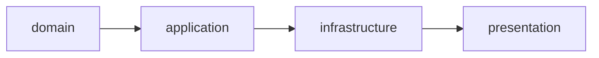
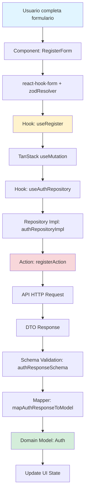
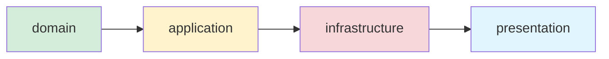
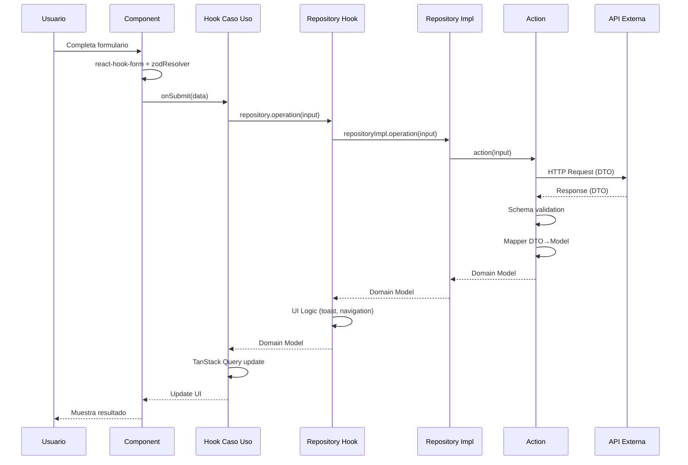

# 🧱 Hexagonal Frontend Architecture + DDD + CQRS

[⬅ Regresar al índice](../real-estate-app.md)

Este proyecto sigue una **arquitectura hexagonal adaptada al frontend**, combinada con principios de **Domain-Driven Design (DDD)** y **CQRS (Command Query Responsibility Segregation)**. La arquitectura está organizada en capas concéntricas que promueven una alta cohesión interna y bajo acoplamiento entre capas. Su objetivo es mantener una estructura escalable, testeable y fácilmente entendible por todo el equipo.

## 🗭 Capas y Responsabilidades

### 1. `domain/` (Capa más interna - Núcleo del Negocio)

**Es el corazón de la aplicación**. Define las reglas de negocio puras sin depender de ningún framework, librería externa o implementación técnica.

- **Propósito:** Modelar y definir las reglas de negocio, entidades y contratos puros.
- **Características:**
  - ✅ **100% independiente** de librerías externas (React, Zod, TanStack, etc.)
  - ✅ Define **models** (entidades del dominio)
  - ✅ Define **inputs** (contratos de entrada a los repositorios)
  - ✅ Define **repositories** (interfaces/contratos de repositorios)
  - ✅ Contiene **helpers** puros de negocio
  - ✅ Define **constants** del dominio

- **Subcarpetas:**

  - `models/`: Entidades del dominio (interfaces TypeScript puras que representan el negocio)
  - `inputs/`: Contratos de entrada para operaciones (basados en CQRS)
  - `repositories/`: Interfaces que definen contratos de repositorios (ports en arquitectura hexagonal)
  - `helpers/`: Funciones puras de lógica de negocio
  - `constants/`: Constantes del dominio

🚫 **No puede importar** de ninguna otra capa ni librerías externas
✅ **Puede ser importada** por todas las capas

---

### 2. `application/` (Capa de Aplicación - Orquestación)

Contiene la lógica de orquestación y define los **commands** que extienden los inputs del dominio con datos adicionales necesarios para formularios u operaciones específicas de la aplicación.

- **Propósito:** Coordinar el comportamiento del sistema y definir comandos específicos de casos de uso.
- **Características:**
  - ✅ Define **commands** (extensiones de inputs con lógica de aplicación)
  - ✅ Puede contener casos de uso complejos
  - ✅ Orquesta múltiples operaciones del dominio

- **Subcarpetas:**

  - `commands/`: Comandos que extienden inputs del dominio (ej: `RegisterCommand` extiende `RegisterInput` agregando `confirmPassword`)

✅ Puede importar de: `domain/`
🚫 **No puede ser importada** por `domain/`

---

### 3. `infrastructure/` (Capa de Infraestructura - Implementación Técnica)

Contiene toda la implementación técnica que interactúa con agentes externos, incluyendo la construcción de **schemas de validación** a partir de los models del domain.

- **Propósito:** Resolver cómo se hacen las cosas, no qué se hace. Actúa como **capa anticorrupción**.
- **Características:**
  - ✅ Construye **schemas** (Zod) a partir de models del domain
  - ✅ Define **DTOs** (Data Transfer Objects) para comunicación externa
  - ✅ Implementa **repository implementations** (adapters)
  - ✅ Contiene **actions** (operaciones HTTP específicas)
  - ✅ Define **mappers** para transformar DTOs a models
  - ✅ Configura **clients** (ky, TanStack Query)

- **Subcarpetas:**

  - `schemas/`: Validaciones Zod construidas a partir de models del domain (usando `satisfies z.ZodType<Model>`)
  - `dtos/`: Objetos de transferencia de datos para APIs externas
  - `mappers/`: Transformadores de DTOs a models del domain
  - `repositories/`: Implementaciones de las interfaces del domain
    - `actions/`: Operaciones HTTP específicas (register.action, login.action, etc.)
    - `*.repository.impl.ts`: Implementaciones que componen las actions
  - `clients/`: Configuraciones de clientes HTTP y caché
  - `constants/`: Endpoints y constantes técnicas

✅ Puede importar de: `application/`, `domain/`
🚫 **No puede ser importada** por `application/`, `domain/`

---

### 4. `presentation/` (Capa de Presentación - UI Framework-specific)

Contiene toda la lógica de presentación específica del framework (React en este caso).

- **Propósito:** Renderizar la interfaz de usuario y conectar con la infraestructura.
- **Características:**
  - ✅ Contiene **components** (React)
  - ✅ Define **hooks** personalizados
  - ✅ Usa **react-hook-form** con **zodResolver** para formularios
  - ✅ Integra **TanStack Query** para gestión de estado servidor

- **Subcarpetas (específicas de React):**

  - `react/`:
    - `components/`: Componentes visuales reutilizables
    - `layouts/`: Estructuras de diseño
    - `containers/`: Componentes que conectan lógica con UI
    - `hooks/`: Custom hooks de React (casos de uso en React)
    - `contexts/`: Contextos de React para estado global
    - `constants/`: Constantes de presentación

✅ Puede importar de: `infrastructure/`, `application/`, `domain/`
🚫 **No puede ser importada** por otras capas (es la capa más externa)

---

## 🔄 Reglas de Dependencia

Las **dependencias deben fluir desde las capas internas hacia las externas**.
Esto significa:


```mermaid
graph LR
    A[domain] --> B[application]
    B --> C[infrastructure]
    C --> D[presentation]
```

**Regla fundamental:** Las capas internas no conocen las externas.

| Capa             | Puede importar de                         | No puede ser importada de     |
| ---------------- | ----------------------------------------- | ----------------------------- |
| `domain`         | Ninguna (100% pura)                       | Todas (es el núcleo)          |
| `application`    | `domain`                                  | `domain`                      |
| `infrastructure` | `application`, `domain`                   | `application`, `domain`       |
| `presentation`   | `infrastructure`, `application`, `domain` | Ninguna (es la capa externa)  |

---

## 🏗️ Patrones Implementados

### 📋 CQRS (Command Query Responsibility Segregation)

Separamos los comandos (escritura) de las consultas (lectura):

- **Inputs** (`domain/inputs/`): Definen contratos puros para operaciones
- **Commands** (`application/commands/`): Extienden inputs con datos específicos de UI/formularios
- **Repository Interfaces** (`domain/repositories/`): Definen contratos de operaciones
- **Repository Implementations** (`infrastructure/repositories/`): Implementan las operaciones

### 🎯 DDD (Domain-Driven Design)

- **Models** son entidades del dominio puras (TypeScript interfaces)
- **Repository Pattern** como capa anticorrupción
- **Value Objects** representados por types e interfaces
- **Aggregates** representados por modelos complejos

### 🔌 Hexagonal Architecture (Ports & Adapters)

- **Ports** (interfaces en `domain/repositories/`): Definen qué se puede hacer
- **Adapters** (implementaciones en `infrastructure/repositories/`): Definen cómo se hace
- **Capa Anticorrupción**: Mappers y DTOs protegen el dominio de cambios externos

---

## 🌊 Flujo Completo de Datos (Ejemplo: Register)

### 📊 Diagrama del Flujo


```mermaid
graph TD
    A[Usuario completa formulario] --> B[Component: RegisterForm]
    B --> C[react-hook-form + zodResolver]
    C --> D[Hook: useRegister]
    D --> E[TanStack useMutation]
    E --> F[Hook: useAuthRepository]
    F --> G[Repository Impl: authRepositoryImpl]
    G --> H[Action: registerAction]
    H --> I[API HTTP Request]
    I --> J[DTO Response]
    J --> K[Schema Validation: authResponseSchema]
    K --> L[Mapper: mapAuthResponseToModel]
    L --> M[Domain Model: Auth]
    M --> N[Update UI State]
    
    style A fill:#e1f5ff
    style M fill:#d4edda
    style D fill:#fff3cd
    style H fill:#f8d7da
```

### 🔢 Flujo Paso a Paso

1. **Component (Presentation)** → `RegisterForm.tsx`
   - Renderiza formulario con `react-hook-form`
   - Usa `zodResolver` con schema de validación del formulario

2. **Schema de Formulario (Infrastructure)** → `register-form-values.schema.ts`
   - Construido desde `RegisterCommand` en application
   - Validación: `z.object({...}) satisfies z.ZodType<RegisterCommand>`

3. **Hook de Caso de Uso (Presentation)** → `useRegister.tsx`
   - Custom hook de React que encapsula la lógica de registro
   - Usa `useMutation` de TanStack Query

4. **Hook de Repositorio (Presentation)** → `useAuthRepository.ts`
   - Wrapper que añade lógica de presentación (redirección, manejo de estado)
   - Usa `authRepositoryImpl` de infrastructure

5. **Repository Implementation (Infrastructure)** → `authRepositoryImpl`
   - Objeto que implementa `AuthRepository` interface
   - Compone todas las actions (register, login, etc.)

6. **Action (Infrastructure)** → `registerAction.ts`
   - Función que hace la petición HTTP
   - Recibe: `RegisterInput` del domain
   - Usa: `api` client (ky) configurado

7. **HTTP Request (Infrastructure)**
   - Request a API externa con DTO
   - Response como DTO

8. **Schema Validation (Infrastructure)** → `authResponseSchema`
   - Valida response del servidor
   - Construido desde model: `satisfies z.ZodType<Auth>`

9. **Mapper (Infrastructure)** → `mapAuthResponseToModel`
   - Transforma DTO a Domain Model
   - **Capa anticorrupción**: protege dominio de cambios en API

10. **Domain Model (Domain)** → `Auth`
    - Entidad pura del dominio
    - Retornada a través de todas las capas

11. **Update UI (Presentation)**
    - TanStack Query actualiza caché
    - React re-renderiza components
    - Context API actualiza estado global

### 📝 Código de Ejemplo del Flujo

#### 1️⃣ Domain Model

```typescript
// domain/models/auth.model.ts
export interface Auth {
  accessToken: string;
  refreshToken: string;
  user: User;
}
```

#### 2️⃣ Domain Input

```typescript
// domain/inputs/auth.input.ts
export interface RegisterInput {
  email: string;
  name: string;
  password: string;
  role: UserRole;
}
```

#### 3️⃣ Application Command

```typescript
// application/commands/register.command.ts
export type RegisterCommand = RegisterInput & {
  confirmPassword: string; // Campo adicional para UI
};
```

#### 4️⃣ Infrastructure Schema (construido desde Model)

```typescript
// infrastructure/schemas/auth.schema.ts
export const authSchema = z.object({
  accessToken: z.string(),
  refreshToken: z.string(),
  user: userSchema,
}) satisfies z.ZodType<Auth>; // ✅ Tipado desde Domain
```

#### 5️⃣ Repository Interface (Domain)

```typescript
// domain/repositories/auth.repository.ts
export interface AuthRepository {
  register(input: RegisterInput): Promise<Auth>;
  loginWithEmailAndPassword(input: LoginWithEmailAndPasswordInput): Promise<Auth>;
  // ...
}
```

#### 6️⃣ Action (Infrastructure)

```typescript
// infrastructure/repositories/actions/auth/register/register.action.ts
export const registerAction = async (input: RegisterInput): Promise<Auth> => {
  const authResponseDto = await api
    .post<AuthResponseDto>(REGISTER_ACTION_URL, { json: input })
    .json();

  const validAuthResponseDto = authResponseSchema.parse(
    mapAuthResponseToModel(authResponseDto)
  );

  return mapAuthResponseToModel(validAuthResponseDto);
};
```

#### 7️⃣ Repository Implementation (Infrastructure)

```typescript
// infrastructure/repositories/actions/auth/auth.repository.impl.ts
export const authRepositoryImpl: AuthRepository = {
  register: registerAction,
  loginWithEmailAndPassword: loginWithEmailAndPasswordAction,
  // ...
};
```

#### 8️⃣ Hook Repository (Presentation)

```typescript
// presentation/react/hooks/auth/use-auth-repository/use-auth-repository.ts
export const useAuthRepository = (): AuthRepository => {
  const { setAuthResponse } = useAuthResponseContext();
  const router = useRouter();

  return {
    register: async (args): Promise<Auth> =>
      asyncFunctionValidationWrapper({
        fn: () => authRepositoryImpl.register(args),
        args,
        onSuccess: (auth) => {
          setAuthResponse(auth);
          router.navigate({ to: '/dashboard' });
        },
      }),
    // ...
  };
};
```

#### 9️⃣ Hook Caso de Uso (Presentation)

```typescript
// presentation/react/hooks/use-register/use-register.tsx
export const useRegister = (): UseRegisterReturn => {
  const authRepository = useAuthRepository();

  const { mutate, isPending, error, data } = useMutation({
    mutationKey: ['register'],
    mutationFn: (args) => authRepository.register(args),
    onSuccess: () => toast.success('Registration successful!'),
    onError: (error) => toast.error(error.message),
  });

  return { onRegister: mutate, isPending, error, data };
};
```

#### 🔟 Component (Presentation)

```typescript
// presentation/react/components/register-form/register-form.tsx
export const RegisterForm = () => {
  const { onRegister, isPending } = useRegister();
  
  const form = useForm<RegisterCommand>({
    resolver: zodResolver(registerFormValuesSchema), // Schema desde Command
  });

  return (
    <Form {...form}>
      <form onSubmit={form.handleSubmit(onRegister)}>
        {/* campos del formulario */}
      </form>
    </Form>
  );
};
```

---

## 🎯 Principios Clave

### 1. **Domain es 100% puro**

- ❌ No usa Zod, React, TanStack, ni ninguna librería externa
- ✅ Solo interfaces TypeScript y tipos puros
- ✅ Define CONTRATOS, no implementaciones

### 2. **Schemas en Infrastructure**

- ✅ Zod schemas construidos DESDE models del domain
- ✅ Uso de `satisfies z.ZodType<Model>` para garantizar coherencia
- ✅ Actúan como capa de validación/anticorrupción

### 3. **Capa Anticorrupción**

- **DTOs** → Estructura de datos externas (API)
- **Mappers** → Transforman DTOs a Models
- **Schemas** → Validan y garantizan integridad
- **Repository Impl** → Protegen dominio de cambios externos

### 4. **Separación Comandos/Consultas (CQRS)**

- **Inputs** → Contratos puros del dominio
- **Commands** → Extensiones con lógica de aplicación
- **Actions** → Implementaciones específicas de operaciones

### 5. **Formularios con Validación**

- ✅ `react-hook-form` para manejo de formularios
- ✅ `zodResolver` para validación
- ✅ Schemas construidos desde Commands
- 🚧 Algunos formularios en migración a este patrón

---

## 🧩 Guías de Uso por Tipo de Código

### 🔌 **Repository (Domain - Interface)**

- Define el **contrato** de qué operaciones se pueden hacer
- Solo declara métodos, no los implementa
- Recibe **Inputs** y retorna **Models**
- **Ubicación:** `domain/repositories/`

### 🎯 **Repository Implementation (Infrastructure)**

- **Implementa** la interface del repository
- Compone múltiples **actions**
- Actúa como orquestador de operaciones
- **Ubicación:** `infrastructure/repositories/actions/*/**.repository.impl.ts`

### ⚡ **Action (Infrastructure)**

- Operación HTTP específica y atómica
- Hace **una sola cosa** (single responsibility)
- Usa DTOs, schemas, mappers
- **Ubicación:** `infrastructure/repositories/actions/*/*.action.ts`

### 📋 **Command (Application)**

- Extiende Input con datos adicionales de UI
- Ejemplo: `RegisterCommand` = `RegisterInput` + `confirmPassword`
- Usado en formularios
- **Ubicación:** `application/commands/`

### 📥 **Input (Domain)**

- Contrato de entrada a repositorios
- Define **qué datos necesita** una operación
- Puro TypeScript, sin validaciones
- **Ubicación:** `domain/inputs/`

### 🏗️ **Model (Domain)**

- Entidad del dominio
- Define **qué es** algo en el negocio
- Solo interfaces TypeScript
- **Ubicación:** `domain/models/`

### ✅ **Schema (Infrastructure)**

- Validación Zod construida DESDE model/command
- Usa `satisfies z.ZodType<Model>` o `satisfies z.ZodType<Command>`
- Garantiza coherencia con domain
- **Ubicación:** `infrastructure/schemas/`

### 🔄 **Mapper (Infrastructure)**

- Transforma DTO → Model
- Capa anticorrupción
- Protege dominio de cambios en API
- **Ubicación:** `infrastructure/mappers/`

### 🎣 **Custom Hook de Caso de Uso (Presentation)**

- Hook de React con `useMutation` o `useQuery`
- Encapsula lógica de un caso de uso específico
- Usa repository hook
- **Ubicación:** `presentation/react/hooks/*/use-*.tsx`

### 🎣 **Repository Hook (Presentation)**

- Wrapper sobre repository implementation
- Añade lógica de presentación (navegación, toast, estado)
- Conecta infrastructure con presentation
- **Ubicación:** `presentation/react/hooks/*/use-*-repository.ts`

### 🧰 **Helper (Domain)**

- Función pura de lógica de negocio
- Sin dependencias externas
- Reutilizable y testeable
- **Ubicación:** `domain/helpers/`

### 🧩 **Component (Presentation)**

- Componente React visual
- Usa custom hooks de casos de uso
- Renderiza UI
- **Ubicación:** `presentation/react/components/`

---

## 🧠 ¿Cómo saber dónde poner mi código?

### Pregunta 1: ¿Es lógica de negocio pura?

- ✅ Sí → `domain/` (models, inputs, helpers, repositories interfaces)
- ❌ No → Siguiente pregunta

### Pregunta 2: ¿Extiende un input con datos de UI/formularios?

- ✅ Sí → `application/commands/`
- ❌ No → Siguiente pregunta

### Pregunta 3: ¿Valida datos o hace HTTP requests?

- ✅ Sí → `infrastructure/` (schemas, actions, repositories impl, mappers)
- ❌ No → Siguiente pregunta

### Pregunta 4: ¿Es un componente React o lógica de UI?

- ✅ Sí → `presentation/react/` (components, hooks, contexts)
- ❌ No → Revisar arquitectura

---

## 🚫 Cosas que NO debes hacer

### ❌ En Domain

- No importar librerías externas (Zod, React, TanStack, etc.)
- No tener lógica de validación (eso va en infrastructure/schemas)
- No tener implementaciones de HTTP (eso va en infrastructure/actions)
- No tener lógica de UI (eso va en presentation)

### ❌ En Application  

- No hacer HTTP requests directamente
- No usar librerías de validación
- No tener lógica de UI

### ❌ En Infrastructure

- No definir contratos (eso va en domain)
- No tener lógica de presentación (eso va en presentation)
- No llamar directamente a hooks de React

### ❌ En Presentation

- No definir models o inputs (eso va en domain)
- No hacer HTTP requests directas (usar repository hooks)
- No tener lógica de negocio compleja (extraer a domain helpers)

---

## ✅ Buenas Prácticas

### 🎯 General

- ✅ Mantén las capas desacopladas
- ✅ Usa absolute imports entre módulos (`@/modules/...`)
- ✅ Usa relative imports dentro del mismo módulo (`./`, `../`)
- ✅ Un archivo = una responsabilidad
- ✅ Nombres descriptivos y consistentes

### 🏗️ Domain

- ✅ Define interfaces claras y semánticas
- ✅ Usa nombres del lenguaje del negocio (ubiquitous language)
- ✅ Mantén los models simples y enfocados
- ✅ Separa inputs de commands (domain vs application)

### 🔧 Infrastructure  

- ✅ Schemas con `satisfies z.ZodType<Model>` para coherencia
- ✅ Un action = una operación HTTP
- ✅ Usa mappers para transformar DTOs
- ✅ Centraliza endpoints en constants

### ⚛️ Presentation

- ✅ Formularios con `react-hook-form` + `zodResolver`
- ✅ Un hook de caso de uso por operación
- ✅ Componentes pequeños y enfocados
- ✅ Usa TanStack Query para estado servidor

### 🧪 Testing

- ✅ Domain helpers son fáciles de testear (funciones puras)
- ✅ Mockea repository implementations para testear hooks
- ✅ Testea components con datos mockeados

---

## 📆 Ejemplo visual (flujo de dependencia)


```mermaid
graph LR
    A[domain] --> B[application]
    B --> C[infrastructure]
    C --> D[presentation]
    
    style A fill:#d4edda
    style B fill:#fff3cd
    style C fill:#f8d7da
    style D fill:#e1f5ff
```

### Flujo de Datos Completo


```mermaid
sequenceDiagram
    participant U as Usuario
    participant C as Component
    participant H as Hook Caso Uso
    participant R as Repository Hook
    participant RI as Repository Impl
    participant A as Action
    participant API as API Externa
    
    U->>C: Completa formulario
    C->>C: react-hook-form + zodResolver
    C->>H: onSubmit(data)
    H->>R: repository.operation(input)
    R->>RI: repositoryImpl.operation(input)
    RI->>A: action(input)
    A->>API: HTTP Request (DTO)
    API-->>A: Response (DTO)
    A->>A: Schema validation
    A->>A: Mapper DTO→Model
    A-->>RI: Domain Model
    RI-->>R: Domain Model
    R->>R: UI Logic (toast, navigation)
    R-->>H: Domain Model
    H->>H: TanStack Query update
    H-->>C: Update UI
    C-->>U: Muestra resultado
```

### Estructura de Carpetas Detallada

```bash
src/app/modules/
├── shared/                           # Módulo compartido entre todos
│   ├── domain/
│   │   ├── models/                   # Entidades del negocio
│   │   │   └── auth.model.ts
│   │   ├── inputs/                   # Contratos de operaciones
│   │   │   └── auth.input.ts
│   │   ├── repositories/             # Interfaces (ports)
│   │   │   └── auth.repository.ts
│   │   ├── helpers/                  # Lógica pura
│   │   └── constants/                # Constantes del dominio
│   │
│   ├── application/
│   │   └── commands/                 # Extensiones de inputs
│   │       └── register.command.ts
│   │
│   ├── infrastructure/
│   │   ├── schemas/                  # Validaciones Zod
│   │   │   └── auth.schema.ts        # satisfies z.ZodType<Auth>
│   │   ├── dtos/                     # Estructuras API
│   │   │   └── auth-response.dto.ts
│   │   ├── mappers/                  # Transformadores
│   │   │   └── auth-response/
│   │   │       └── auth-response.mapper.ts
│   │   ├── repositories/
│   │   │   ├── actions/              # Operaciones HTTP
│   │   │   │   └── auth/
│   │   │   │       ├── register/
│   │   │   │       │   └── register.action.ts
│   │   │   │       └── auth.repository.impl.ts
│   │   ├── clients/                  # HTTP clients
│   │   │   ├── ky/
│   │   │   └── query/
│   │   └── constants/                # Endpoints
│   │
│   └── presentation/
│       └── react/
│           ├── components/           # UI Components
│           │   └── register-form/
│           ├── hooks/                # Custom hooks
│           │   └── use-register/
│           ├── contexts/             # React contexts
│           └── layouts/
│
├── auth/                             # Módulo específico de auth
│   └── presentation/
│       └── react/
│           ├── components/
│           ├── containers/
│           └── route.tsx             # Route definition
│
└── properties/                       # Módulo específico de properties
    ├── domain/
    ├── application/
    ├── infrastructure/
    └── presentation/
```

> [!NOTE]
> Puede copiar el código y ver el diagrama en <https://mermaid.live/>

---

## 🔧 Configuración de ESLint para Arquitectura

La regla personalizada `hexagonal/no-invalid-architecture-imports` se actualizo para validar:

### ✅ Validaciones Implementadas

1. **Domain no puede importar librerías externas**

   ```typescript
   // ❌ INCORRECTO en domain/
   import z from 'zod';
   
   // ✅ CORRECTO en domain/
   export interface Auth {
     accessToken: string;
     refreshToken: string;
   }
   ```

2. **Flujo de dependencias correcto**

   ```typescript
   // ✅ CORRECTO: infrastructure → application → domain
   // infrastructure/schemas/auth.schema.ts
   import type { Auth } from '@/modules/shared/domain/models/auth.model';
   import z from 'zod';
   
   export const authSchema = z.object({
     accessToken: z.string(),
     refreshToken: z.string(),
   }) satisfies z.ZodType<Auth>;
   ```

3. **Imports entre módulos solo via shared**

   ```typescript
   // ❌ INCORRECTO
   import { User } from '@/modules/admin/domain/models/user.model';
   
   // ✅ CORRECTO
   import { User } from '@/modules/shared/domain/models/user.model';
   ```

### ⚙️ Configuración

Ver configuración completa en:

- [no-invalid-architecture-imports.mjs](../../tools/eslint-plugin-hexagonal/rules/no-invalid-architecture-imports.mjs)
- [eslint.config.base.mjs](../../config/eslint/eslint.config.base.mjs)

---

## 🚧 Estado Actual del Proyecto

### ✅ Completamente Implementado

- ✅ Domain 100% puro (sin dependencias externas)
- ✅ Schemas en infrastructure construidos desde models
- ✅ Repository pattern con interfaces y implementations
- ✅ Actions para operaciones HTTP
- ✅ Mappers como capa anticorrupción
- ✅ ESLint rules para validar arquitectura

### 🚧 En Progreso

- 🚧 Migración de formularios a `react-hook-form` + `zodResolver`
- 🚧 Refactorización de componentes legacy
- 🚧 Mejoras en testing de capas

### 📝 Notas

- Todos los formularios **deberían** usar `react-hook-form` + `zodResolver`
- Si encuentras formularios sin este patrón, están en proceso de migración
- Hay algunas malas prácticas en componentes legacy que se irán solucionando

---
